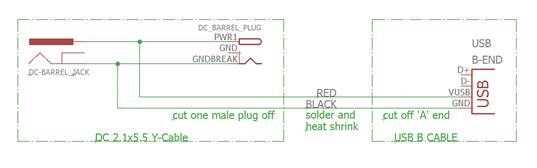
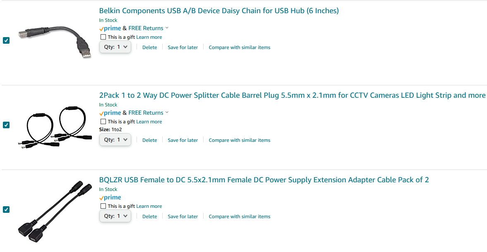

# Main Components
* Servo: [HS-422 Deluxe Standard Servo | HITEC RCD USA](https://hitecrcd.com/products/servos/sport-servos/analog-sport-servos/hs-422/product)

* Servo Motor Driver PCA9685: [https://www.amazon.com/dp/B07Z8R2YB9](https://www.amazon.com/dp/B07Z8R2YB9) $13.99

* Arduino Uno: [https://www.amazon.com/dp/B008GRTSV6](https://www.amazon.com/dp/B008GRTSV6) $22.50

* Arduino Uno case: [https://www.amazon.com/dp/B01C8500L8](https://www.amazon.com/dp/B01C8500L8)$4.89

 * 5V 4A Power Supply Charger  DC 5.5mm x 2.1mm: [https://www.amazon.com/dp/B08VWVLBWF](https://www.amazon.com/dp/B08VWVLBWF) $11.99

# Conectors

* Female Red Black DC Power Pigtail Female Cable Lead Plug 10in 2.1x5.5mm [https://www.amazon.com/dp/B01N5JHFC0](https://www.amazon.com/dp/B01N5JHFC0) $8.59

* 1x Female Jack to AV 2 Screw Terminal Connector [https://www.amazon.com/dp/B07TT14RGF](https://www.amazon.com/dp/B07TT14RGF) $8.99 

# Cables
 * 1x 25 feet bnc cable [https://www.amazon.com/dp/B07R567S3J](https://www.amazon.com/dp/B07R567S3J) $31.99

 * 5.5mm x 2.1mm Extension Cord (5m), [https://www.amazon.com/dp/B08GZ8JP87](https://www.amazon.com/dp/B08GZ8JP87) $8.99

 * 900mm Servo Extension: [https://www.amazon.com/dp/B074SZXXGM](https://www.amazon.com/dp/B074SZXXGM) $10.90

 * Jumper wires: [https://www.amazon.com/dp/B07GD2BWPY](https://www.amazon.com/dp/B07GD2BWPY) $5.99

 # Power cable

## Cable fabrication (Steve)
 
 ## Off the shelf solution
 